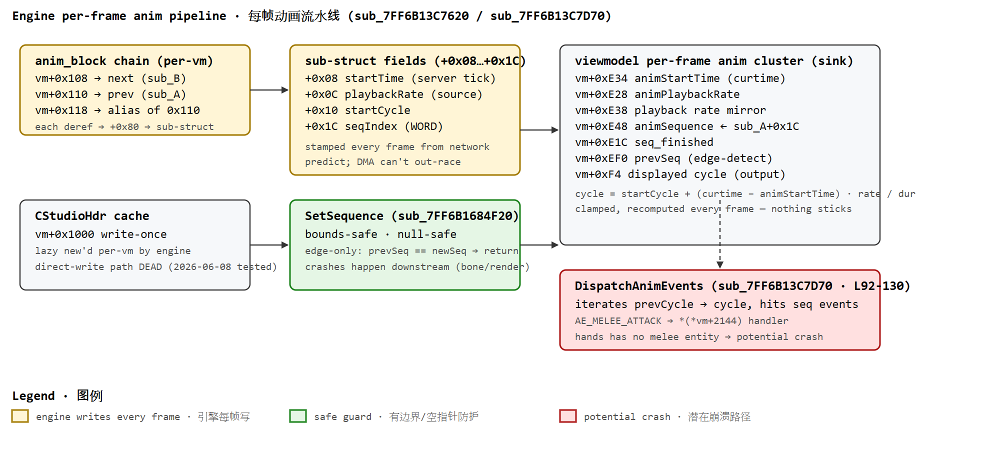
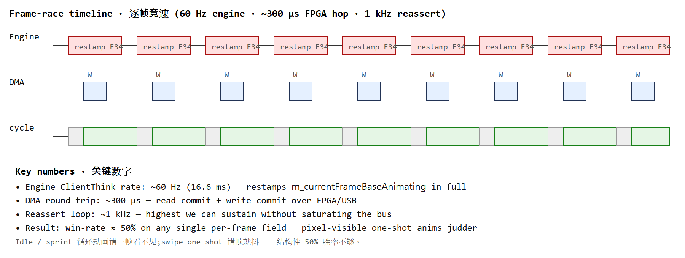
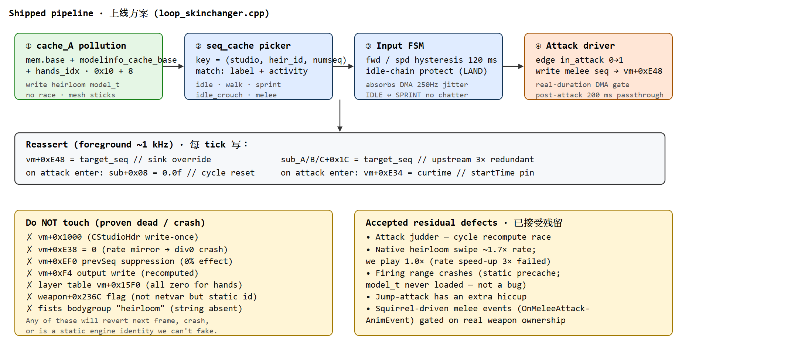

<h1 align="center">Apex Legends — Heirloom Animation via External DMA</h1>
<h3 align="center">Ceiling, Architecture, and Why It Ends Here</h3>

<a href="#中文"><b>👉 跳转中文版本 · Jump to Chinese version</b></a>

---

## English

### TL;DR

For a **non-owner** using **pure external DMA**, native heirloom animation is **impossible**. The engine recomputes the entire `m_currentFrameBaseAnimating` block every frame; a ~300 µs DMA write cannot win against local per-frame stamping. Best achievable ceiling: **cache pollution swaps the mesh + FSM force-writes the seq index** — visuals are correct, attack judders. The only way past that ceiling is **in-process code injection** (DLL / driver / self-map), which is no longer "pure external".

### 1. Problem

Apex Legends only lets owners equip heirloom skins. We want a non-owner to see the heirloom mesh and play native heirloom idle / walk / sprint / inspect / melee sequences on their own client, driven entirely by an external DMA reader (FPGA / vmm) — no injected DLL, no user-mode hook, no ring-0 driver writing scattered viewmodel state.

### 2. Engine Animation Pipeline (r641)

The pipeline is `network → anim_block → sub-struct+0x1C → SetSequence → vm+0xE48`. The engine then derives `vm+0xF4 (displayed cycle)` from `startTime / rate / dur`. The critical property: **every field in the anim cluster is a sink**, restamped from upstream sub-structs each frame. External writes at any downstream point get overwritten on the next tick.

### 3. Attempts

| # | Approach | Layer | Verdict |
|---|---|---|---|
| 1 | Write `vm+0xE48` seq directly | sink (E48) | **Works for mesh + idle**; attack judders (`cycle` recomputes from stale `startTime`). |
| 2 | Write `vm+0xE34 = fixed startTime` every frame | input to cycle | Engine restamps ~1 kHz; DMA wins ~50%. Judders. |
| 3 | Write `vm+0xE38 = 0` (start-cycle mirror) | mirror | **Crashes game** (0xE38 is playback-rate mirror; =0 divides by zero). |
| 4 | Write `vm+0xEF0 = seq` to suppress seq-change edge | edge gate | 0% effect — re-stamper doesn't come from that detector. |
| 5 | Direct-write output `vm+0xF4 = clamped progress` | sink | Engine recomputes every frame — external write lost. |
| 6 | Direct-write `vm+0x1000` = heirloom `CStudioHdr` | write-once | No independent heirloom studio exists; `**(model_t+0x30)` is `studiohdr_t`, not `CStudioHdr`. |
| 7 | Stop FSM, let engine dispatch natively | dispatch | Engine dispatches **fists** activity set (39/21/29) — never picks heirloom seqs. |
| 8 | Fake "equipped heirloom" weapon entity | entity | Weapon def identity is a static engine table (`fists ≠ heirloom`) — replicated every tick, DMA can't hold. |
| 9 | Toggle bodygroup mod `"heirloom"` on fists | model | `"heirloom"` mod string lives in the heirloom's own studiohdr mod-table, not fists' → no bit to flip. |
| 10 | **Cache pollution + FSM force-write seq** *(ceiling)* | model_t + sink | **Ships.** Mesh swaps clean. Idle/walk/sprint smooth. Attack judders (accepted). |

### 4. Why External DMA Loses

The engine restamps the entire animation output block *from network prediction* every frame. External writes land, engine overwrites, external writes again — win rate hovers near 50%. One-shot animations (swipe) show visible frame errors on every loss. Looping animations (idle, sprint) hide the loss because the next tick still shows a valid frame of the same seq.

### 5. Shipped Ceiling Architecture

**Implementation notes.**
- **Cache pollution** at `mem.base + modelinfo_cache_base + hands_idx * 0x10 + 8` is the only race-free write. Everything downstream fights the engine.
- **`vm+0x1000`** hosts a per-viewmodel `CStudioHdr` object the engine lazy-`new`s from the model's `studio-id`. No independent heirloom `CStudioHdr` exists to point it at — the object under `**(model_t+0x30)` is a raw `studiohdr_t`, incompatible.
- **`SetSequence` is edge-only** (`prevSeq==newSeq → return`). A combo re-attack won't replay from cycle 0. Workaround: on enter, write a different seq for one tick then write the real target — creates the change-edge.
- **Non-current vm cache invalidation.** Cached `sub_A/B/C_ptr` become dangling on respawn / character swap / studio reload. Guard: recapture `cstudiohdr` in the cache entry; drop the entry if `vm+0x1000` or `numseq` diverge.
- **Real seq duration via DMA.** `duration = (numframes - 1) / fps`, chain: `seqdesc+0x2A` packed index (decode `(w&0xFFFE) << (4*(w&1))`) → `animdesc+0x00 fps`, `animdesc+0x08 numframes`.

### 6. Path past the ceiling

**In-process code injection.** Hook the anim dispatcher from inside the game process and skip the DMA round-trip. Not "pure external" any more — threat model changes (DLL / driver / self-map, all Anti-Cheat surface).

Everything else (network anim source, ownership fake, weapon-def swap, `vm+0x1000` retarget) has been examined at IDA level or on-target and failed for the reasons above.

### 7. Repro / Data Points

- Build: r641 layout (dump labeled `r426`), base `0x7FF6B0BD0000`
- IDA anchors:
  - `sub_7FF6B13C7620` — per-frame anim driver (a1 = vm+24)
  - `sub_7FF6B13C7D70` — ClientThink; L92-130 stamps `sub_A[0..140] → vm+0xE34-0xE48`
  - `sub_7FF6B1684F20` — `SetSequence` (bounds-safe)
  - `sub_7FF6B1685F70` — `CStudioHdr` resolver from model
  - `sub_7FF6B1689FB0` — `Anim_SetPlaybackRate` (writes `vm+0xF4 + 0xE38 + 0xE34`)

### 8. Reference code

Sanitized single-file reference — [`heirloom_anim_reference.cpp`](./heirloom_anim_reference.cpp) (~685 lines). Not a working build; drops the production infrastructure (config system, threading, reader context, logging, obfuscation) and keeps just the mechanism: modelprecache resolver, studio parsing, seq-cache picker, `cache_A` pollution with restore, dangling-vm guard, and the 3-phase attack FSM.

Assumes a `namespace dma { Read / Write / *Scatter* }` API declared at the top of the file — swap in your own reader.

---
---

<a href="#english"><b>👆 Back to English · 返回英文顶部</b></a>

## 中文

### TL;DR

非拥有者用**纯外部 DMA** 拿原生传家宝动画 **不可能**。引擎每帧重算整个 `m_currentFrameBaseAnimating` 块,~300 µs 的 DMA 写永远压不过本地逐帧盖写。天花板 = **cache 污染换 mesh + FSM 强写 seq**（视觉对、攻击抽搐）。越过这层天花板只剩一条路:**游戏进程内注入代码**（DLL / 驱动 / self-map），已不算"纯外部"。

### 1. 问题

Apex 只允许拥有者用传家宝皮肤。目标是让非拥有者的本地客户端看到传家宝模型 + 播放原生 idle / 走 / 冲刺 / 检视 / 挥击动画,全靠外部 DMA 读写驱动 —— 不注入 DLL、不做用户态 hook、不用 ring-0 驱动写 viewmodel 散状态。

### 2. 引擎动画流水线（r641）

流水线 = `网络 → anim_block → sub-struct+0x1C → SetSequence → vm+0xE48`,随后引擎按 `startTime / rate / dur` 算 `vm+0xF4(显示 cycle)`。关键性质:**整个 anim 簇每个字段都是 sink**,每帧从上游 sub-struct 重刷;下游任意点的外部写都会在下一 tick 被盖掉。

### 3. 尝试过的路径

| # | 方案 | 层 | 结论 |
|---|---|---|---|
| 1 | 直写 `vm+0xE48` seq | sink (E48) | **换 mesh + idle 都对**,攻击抽搐(`cycle` 用陈旧 `startTime` 重算)。 |
| 2 | 每帧钉 `vm+0xE34 = 固定 startTime` | cycle 输入 | 引擎每帧重拍,DMA 只赢 ~50%,仍抖。 |
| 3 | 写 `vm+0xE38 = 0`（起点 cycle 镜像） | 镜像 | **崩游戏**(0xE38 是 rate 镜像,=0 除零)。 |
| 4 | 写 `vm+0xEF0 = seq` 抑制 seq 变化边沿 | 边沿闸 | 0% 生效 —— 重拍器不来自这个检测器。 |
| 5 | 直写输出 `vm+0xF4 = clamp 进度` | sink | 引擎每帧重算,外部写丢失。 |
| 6 | 直写 `vm+0x1000` = 传家宝 `CStudioHdr` | write-once | 根本没有独立传家宝 `CStudioHdr`;`**(model_t+0x30)` 是裸 `studiohdr_t`,不兼容。 |
| 7 | 停 FSM 让引擎原生派发 | dispatch | 引擎按**空手**动作集(39/21/29)派发,永不挑传家宝 seq。 |
| 8 | 伪造"已装备传家宝"武器实体 | entity | 武器 def 身份是静态引擎表(`fists ≠ heirloom`),每 tick 复制,DMA 维持不住。 |
| 9 | 在空手上开 bodygroup mod `"heirloom"` | model | `"heirloom"` mod 串在传家宝自己的 studiohdr mod 表里,不在空手 → 没 bit 可翻。 |
| 10 | **cache 污染 + FSM 强写 seq**（天花板） | model_t + sink | **已上线**。mesh 干净替换,idle/走/冲刺平滑,攻击抽搐(接受)。 |

### 4. 为何外部 DMA 输

引擎每帧从**网络预测**重刷整个动画输出块。外部写、引擎盖、再外部写 —— 胜率 ~50%。one-shot 动画(挥击)一次输就是可见错帧;循环动画(idle/sprint)因为下一帧还在同 seq 内所以看不到输的那次。

### 5. 上线的天花板方案

**实现要点。**
- **cache 污染** 写 `mem.base + modelinfo_cache_base + hands_idx * 0x10 + 8` 是**唯一无 race 的写**;下游任何写都在跟引擎打架。
- **`vm+0x1000`** 是引擎按 model 的 studio-id 现 `new` 的 `CStudioHdr`。**根本没有独立的传家宝 `CStudioHdr` 可指**,`**(model_t+0x30)` 是裸 `studiohdr_t`,结构不兼容。
- **`SetSequence` 只在边沿触发**(`prevSeq==newSeq` 直接 return),连击第二刀不从 0 播。修法:入场先写别的 seq 一 tick 再写目标 —— 造 change-edge。
- **非当前 vm 缓存悬空**:重生/换角色/studio 重载后 `sub_A/B/C_ptr` 失效。保护:缓存里记 `cstudiohdr`,`vm+0x1000` 或 `numseq` 变了就丢 entry。
- **真实 seq 时长通过 DMA 读**:`duration = (numframes - 1) / fps`,链 = `seqdesc+0x2A` packed idx(解码 `(w&0xFFFE) << (4*(w&1))`) → `animdesc+0x00 fps` + `animdesc+0x08 numframes`。

### 6. 越过天花板的路

**游戏进程内注入代码**。从进程内 hook 动画派发器,砍掉 DMA 往返。已不是"纯外部",威胁模型换了(DLL / 驱动 / self-map,全是反作弊面)。

其他路径(网络 anim 源驱动、伪造拥有态、换 weapon def、`vm+0x1000` 直写)都在 IDA 或实机上验过失败,原因见上。

### 7. 复现坐标

- Build:r641 layout(dump 名 `r426`),base `0x7FF6B0BD0000`
- IDA 锚点:
  - `sub_7FF6B13C7620` —— 每帧 anim driver(a1 = vm+24)
  - `sub_7FF6B13C7D70` —— ClientThink;L92-130 拷 `sub_A[0..140] → vm+0xE34-0xE48`
  - `sub_7FF6B1684F20` —— `SetSequence`(bounds-safe)
  - `sub_7FF6B1685F70` —— 从 model 解 `CStudioHdr`
  - `sub_7FF6B1689FB0` —— `Anim_SetPlaybackRate`(写 `vm+0xF4 + 0xE38 + 0xE34`)

### 8. 参考代码

脱敏单文件 —— [`heirloom_anim_reference.cpp`](./heirloom_anim_reference.cpp)（约 685 行）。不是可编译工程,剥掉生产端基础设施（config 系统、线程、reader 上下文、日志、字符串混淆）,只留机制:modelprecache resolver、studio 解析、seq-cache picker、`cache_A` 污染与还原、悬空 vm 守卫、3 阶段攻击 FSM。

顶部声明了一个 `namespace dma { Read / Write / *Scatter* }` API 占位,换成自己的 DMA reader 即可。

